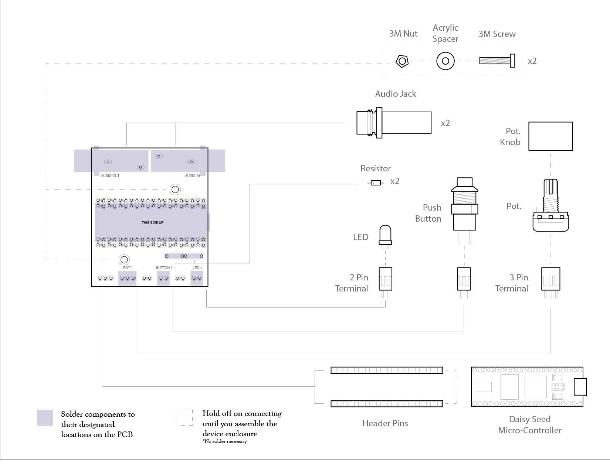
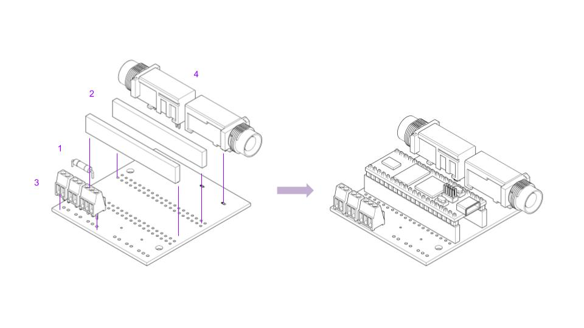

# Electronics Assembly

Here is the electronics page, where we will document the basics on how to assemble the electronics. We will include some tips on soldering and suggest a logical assembly order. 

Solder the following components into the Printed Circuit Board (PCB). Make sure “this side up” is facing up on the PCB and components sit on top.

1. Resistor into I/O 1 (Clip the excess wire of the resistor off after it is secure in the board)
2. Receiving header pins into the PCB
3. Terminal Blocks into BUTTON 1, POT 1, and LED 1 
4. Input/Output Jacks to AUDIO IN and AUDIO OUT

Your board should look like this:

Note: we can hold off on attatching the potentiometer and button into the terminal blocks until we build the enclosure.

